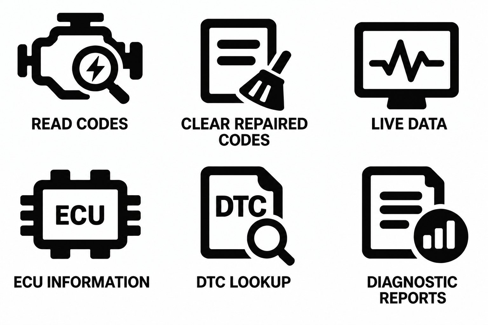
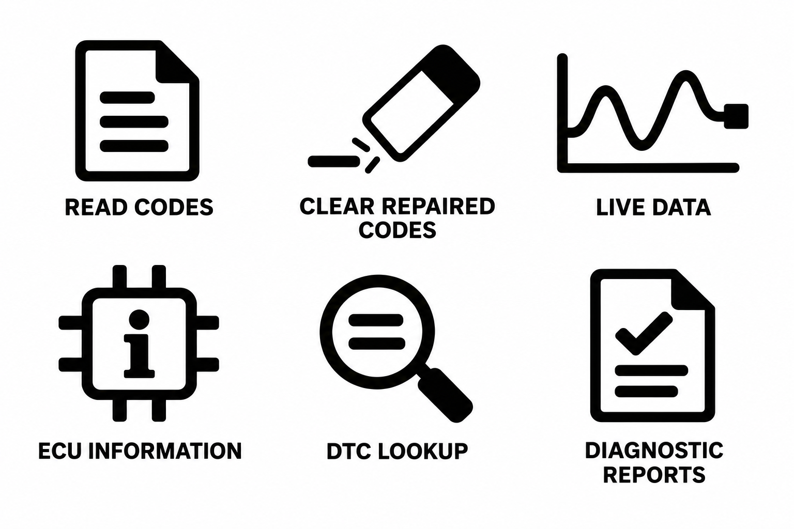

# 诊断六图：成功与失败验收参考

## 适用范围与证据

用户于 2026-09-05 明确标注两张上传图分别为“失败的图”“成功的图”，并授权“记录进 skill 里面，验收标准的一个参考”。

级别：B级｜当前已认可的诊断线面结合风格参考。用于该风格及明确要求沿用该风格的任务；不自动升级为 C/D 级通用硬标准，不覆盖今后其他风格。用户的成败判定是直接证据；下面原因是图像对比分析，并不证明历史生成调用了哪个 Skill 或通过了小尺寸测试。

## 原图

### 成功参考

### 失败参考

## 功能与构造对照

| 功能 | 成功图可学习内容 | 失败图的不足 |
|---|---|---|
| READ CODES | 发动机建立车辆语境，放大镜与内部闪电形成紧密组合 | 文件加横线，读取诊断身份弱 |
| CLEAR REPAIRED CODES | 文件交代对象，扫把表达清除；遮挡与白色间隙使组合清楚 | 孤立橡皮擦和短线碎片，清除对象不清 |
| LIVE DATA | 显示器承载波形，实心底座稳定重量 | 开放坐标轴横向延伸，端部黑块缺乏明确功能依据 |
| ECU INFORMATION | 芯片轮廓、短粗引脚与 ECU 缩写共同识别 | 通用信息 i 的字形与整组几何风格不一致 |
| DTC LOOKUP | DTC 文件明确查询对象，放大镜表达查询 | 放大镜内两条横线更接近通用文本搜索 |
| DIAGNOSTIC REPORTS | 文件与统计图表达结果报告 | 文件与对勾偏向完成或通过，和读取图标区分不足 |

这是对用户偏好样例的解释，不宣称闪电、扫把等是行业唯一正确符号。新文案仍须重新做语义矩阵。

## 验收时学习的关系

- 简洁：保留足够身份与动作线索，删除重复、装饰和无意义碎线；不是机械追求最少图形。成功的发动机、放大镜、闪电共同服务一个功能，不应机械拆为三个独立概念而删除。
- 一体化：可通过嵌入、局部遮挡、轮廓让位和明确负空间实现；不要求所有组件物理连通。
- 线面：粗稳定轮廓、宽而清楚的留白与有作用的实心结构配合；不把粗线本身等同于完成线面设计，也不要求相同黑色面积百分比。
- 系列：统一构造语言和光学重量，允许文件等语义载体复用；清除、查询、报告必须由完整组合形成明显差异。
- 缩写：ECU、DTC 可作为必要行业识别；与芯片、文件、查询动作共同工作，避免长句和装饰文字。
- 构图：偏正方形是光学目标。成功图的发动机、ECU 仍偏宽，不应强制压入相同比例；控制无用延伸与重量失衡。
- 修改：小幅调整后同时比较修改前后和整组；所有成员复查，发现问题才改，不任意重画已认可结构。
- 尺寸：用户认可的是所示成图，尚无实际目标尺寸和24/32px测试证据。按用途验收，另检查缩略适配；必要时提供简化小尺寸版本，而不以未经验证的小尺寸门槛否定已认可母版。

## 不吸收为永久规则

不强制所有图标使用发动机、显示器、文件、右下角圆章、闪电、扫把或三元素组合；不固定两行三列，不将这张图的圆角与文字排版套到其他风格；不取消其他项目的小尺寸可读要求。

## 与通用规则的关系

仅在明确沿用本风格时，按本参考解释“1主体＋辅助语义”“载体重复”“设备不是默认主体”和小尺寸验收：按语义角色判断而非机械数图形；显示器可服务实时数据语义，但不要求每枚加入诊断仪。其他风格继续按原有规则执行。

对应测试：[Case 14](../evals/cases.md#case-14--用户确认的诊断六图正反验收参考)。
